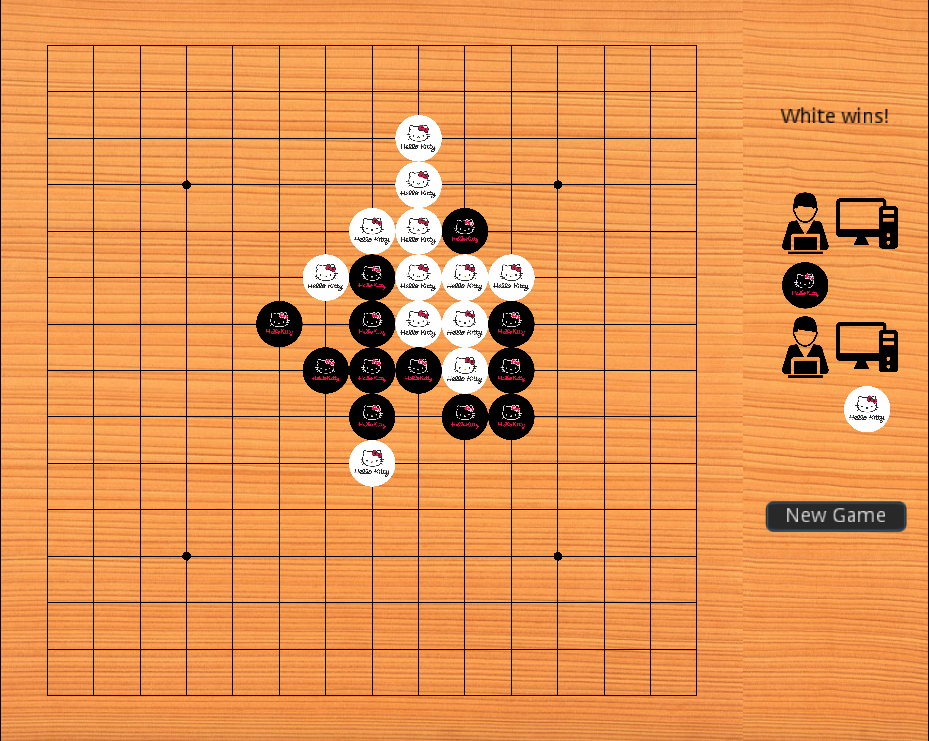

# Godot Games

## [Matching](https://henryrlee.github.io/GodotGames/Matching/)

Matching (连连看) is the first Godot game I developed.

The rule of the game is simple:

* Find two matching images that can be connected with no more than three
straight lines in cardinal directions
* Click on the images pair to eliminate them
* The game finishes when you eliminate all the images

This game is a gift for my dear Catherine.

The assets were borrowed from this
[Zhihu page](https://zhuanlan.zhihu.com/p/141303512).

## [Gomoku](https://henryrlee.github.io/GodotGames/Gomoku/)

Gomoku (五子棋) is another game I made for Catherine.

The goal of the game is to make five consecutive pieces in a cardinal
or diagonal direction.
